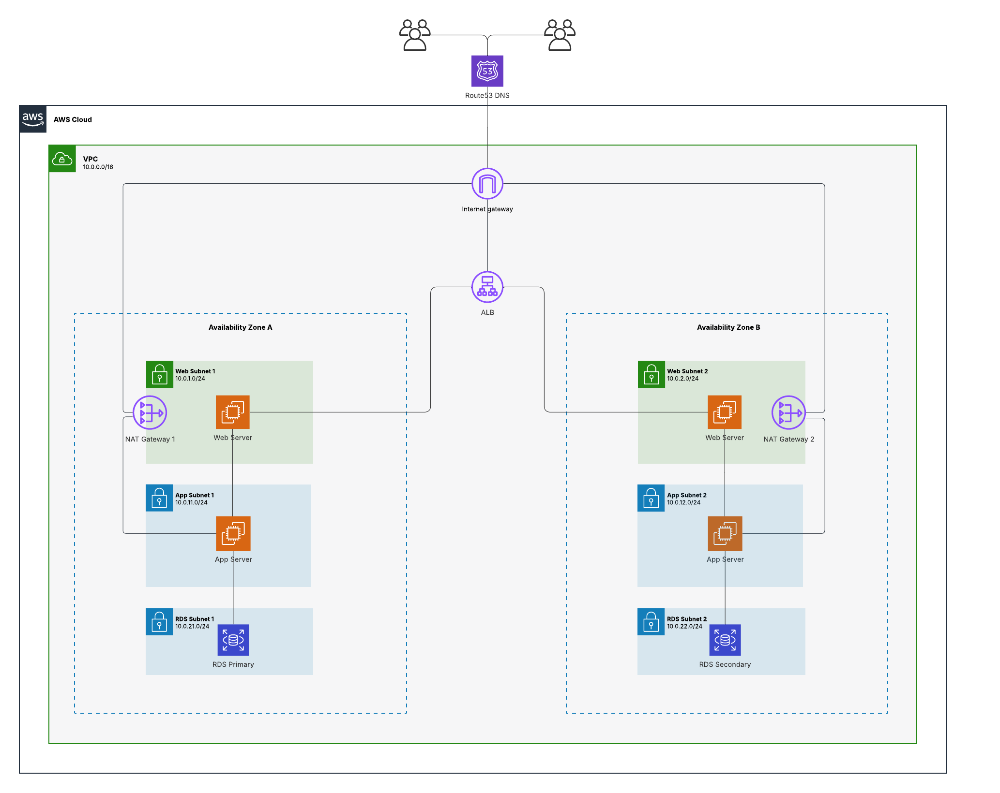

# High Availability 3-Tier Web Architecture on AWS with Terraform

This project provisions a production-grade, highly available 3-Tier Web Architecture on AWS using Terraform. It demonstrates infrastructure-as-code (IaC) best practices, including Multi-AZ redundancy, secure networking with NAT Gateways, and strict security group chaining.



## 🏗 Architecture Overview

The infrastructure is designed for fault tolerance and security, distributed across **two Availability Zones (us-east-1a, us-east-1b)**.

### 1. Presentation Tier (Public)
* **Application Load Balancer (ALB):** Distributes incoming HTTP traffic across web servers in multiple zones.
* **Web Servers (Apache):** Hosted in public subnets to serve static content and proxy requests.
* **NAT Gateways:** Two distinct NAT Gateways (one per zone) to provide secure internet access for private instances without exposing them to inbound traffic.

### 2. Application Tier (Private)
* **Node.js App Servers:** Hosted in private subnets. They run a Node.js API and are not accessible directly from the internet.
* **Security:** Only accepts traffic from the Web Tier Security Group.

### 3. Data Tier (Private)
* **RDS MySQL (Multi-AZ):** A primary database instance with a synchronous standby replica in a second availability zone for automatic failover.
* **Security:** Locked down to only accept connections from the Application Tier.

## 🚀 Features
* **High Availability:** All layers (Web, App, DB, Network) are redundant across two zones.
* **Security:** "Defense in Depth" strategy using VPC, Private Subnets, and Security Group chaining.
* **Resiliency:** If one Availability Zone goes offline, the application remains fully functional using resources in the second zone.
* **Automation:** Full infrastructure provisioning via Terraform user data scripts.

## 🛠 Prerequisites

* **Terraform:** v1.0+ installed locally.
* **AWS CLI:** Configured with valid credentials (`aws configure`).
* **SSH Key Pair:** An AWS EC2 Key Pair named `my-key-pair` created in `us-east-1`.

## 📂 Project Structure

* `main.tf` / `provider.tf`: Provider configuration.
* `vpc.tf` / `subnet.tf` / `route_table.tf` / `nat.tf`: Networking core.
* `ec2.tf` / `app_ec2.tf`: Compute resources (Web & App tiers).
* `rds.tf`: Database resources.
* `alb.tf`: Load Balancer and Target Groups.
* `*_sg.tf`: Security Groups (Firewalls).

## ⚡ Deployment Instructions

**1. Initialize Terraform**
Download required providers and initialize the backend.
```bash
terraform init

```

**2. Plan Terraform**

Review the Plan Check the resources that will be created. You must provide a secure password for the database.
```bash
terraform plan -var="db_password=YourSecurePassword123"

```

**3. Apply Terraform**

Apply Infrastructure Provision the environment
```bash
terraform apply -var="db_password=YourSecurePassword123" --auto-approve

```