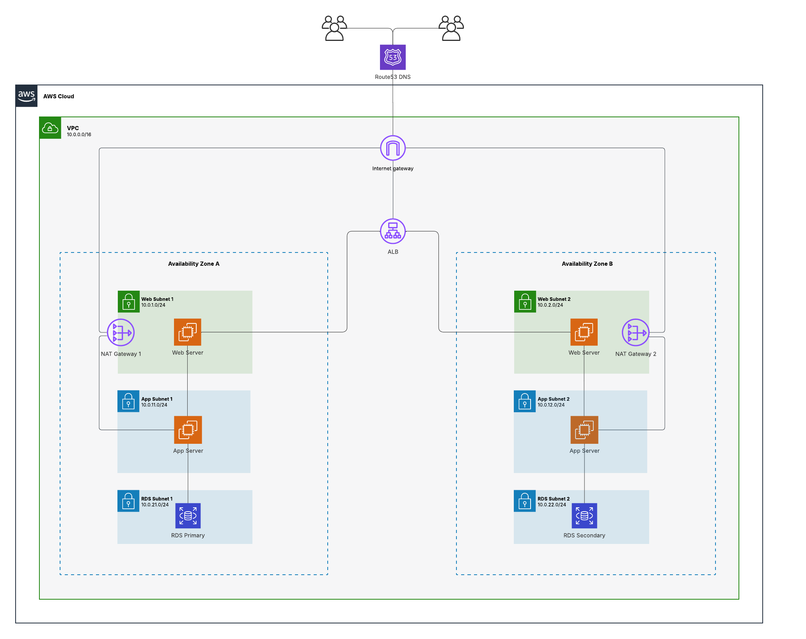

# High Availability 3-Tier Web Architecture on AWS with Terraform

This project provisions a production-grade, highly available 3-Tier Web Architecture on AWS using Terraform. It demonstrates infrastructure-as-code (IaC) best practices, including Multi-AZ redundancy, secure networking with NAT Gateways, strict security group chaining, and dynamic instance bootstrapping.



## 🏛️ Architecture Overview

The infrastructure is designed for fault tolerance and security, distributed across **two Availability Zones (us-east-1a, us-east-1b)**.

### 1. Presentation Tier (Public)
* **External Application Load Balancer (ALB):** Distributes incoming HTTP traffic from the internet across the web servers.
* **Web Servers (Apache on Port 80):** Hosted in public subnets. They serve a dedicated health check file (`/health.html`) and act as a secure reverse proxy, forwarding all other traffic to the Internal ALB.
* **NAT Gateways:** Two distinct NAT Gateways (one per zone) to provide secure internet access for private App Tier instances (for downloading packages like Node.js) without exposing them to inbound traffic.

### 2. Application Tier (Private)
* **Internal Application Load Balancer (ALB):** Acts as the secure middleman, taking traffic from the Web Tier proxy and distributing it across the App Servers.
* **Node.js App Servers (Port 3000):** Hosted in private subnets. They run the core Node.js application, evaluate a lightweight `/health` route, and maintain the active connection to the database.
* **Security:** Locked down to strictly accept traffic *only* from the Internal ALB Security Group.

### 3. Data Tier (Private)
* **RDS MySQL (Multi-AZ):** A primary database instance with a synchronous standby replica in a second availability zone for automatic failover.
* **Security:** Locked down to strictly accept connections *only* from the Application Tier Security Group.

## ✨ Key Features
* **Keyless Access (SSM):** No SSH keys required. Instances are accessed securely via AWS Systems Manager (SSM) Session Manager, entirely eliminating the need to expose Port 22.
* **High Availability:** All layers (Web, App, DB, Network) are redundant across two zones.
* **Security:** "Defense in Depth" strategy using VPC, Private Subnets, and Security Group chaining.
* **Dynamic Bootstrapping:** Uses Terraform's `templatefile()` function to seamlessly inject live infrastructure endpoints (Internal ALB DNS, RDS Endpoints) directly into the EC2 user data deployment scripts at runtime.
* **Dedicated Health Checks:** Implements custom, lightweight health check paths to ensure accurate Target Group routing without triggering false positives.

## 🛠️ Prerequisites

* **Terraform:** v1.0+ installed locally.
* **AWS CLI:** Configured with valid credentials (`aws configure`).
* *(Note: An SSH Key Pair is **not** required for this project, as access is managed securely via AWS SSM).*

## 📂 Project Structure

* `main.tf` / `provider.tf`: Provider configuration.
* `vpc.tf` / `subnet.tf` / `route_table.tf` / `nat.tf`: Networking core.
* `ec2.tf` / `app_ec2.tf`: Compute resources (Web & App tiers) with SSM instance profiles attached.
* `rds.tf`: Database resources.
* `alb.tf`: Load Balancers and Target Groups.
* `*_sg.tf`: Security Groups (Firewalls).

## 🚀 Deployment Instructions

**1. Initialize Terraform**
Download required providers and initialize the backend.
```bash
terraform init

```

**2. Plan Terraform**

Review the Plan Check the resources that will be created. You must provide a secure password for the database.
```bash
terraform plan -var="db_password=YourSecurePassword123"

```

**3. Apply Terraform**

Apply Infrastructure Provision the environment
```bash
terraform apply -var="db_password=YourSecurePassword123" --auto-approve

```